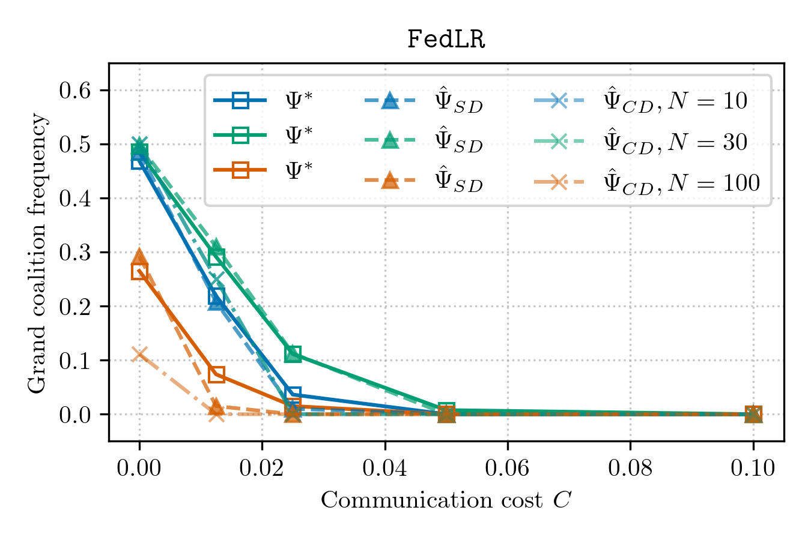
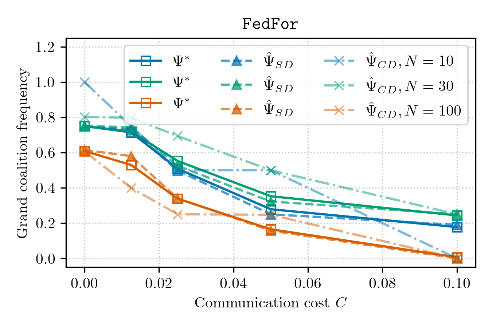
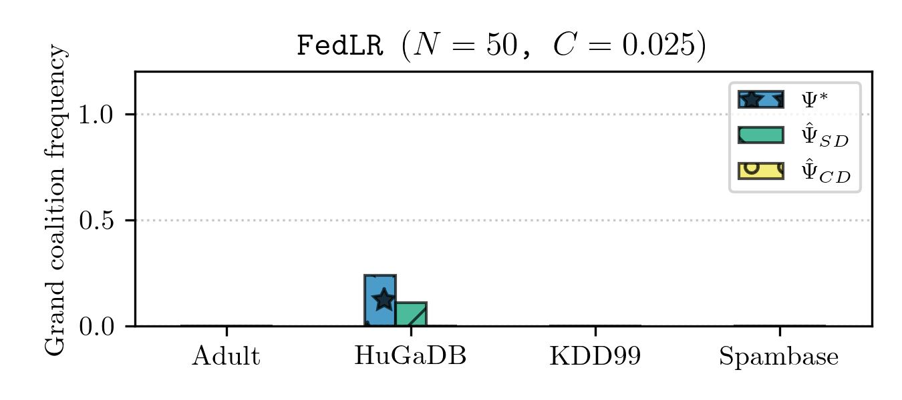
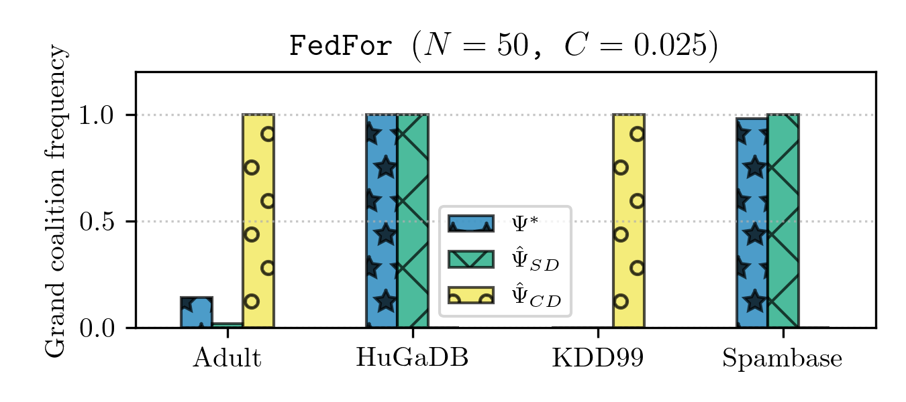
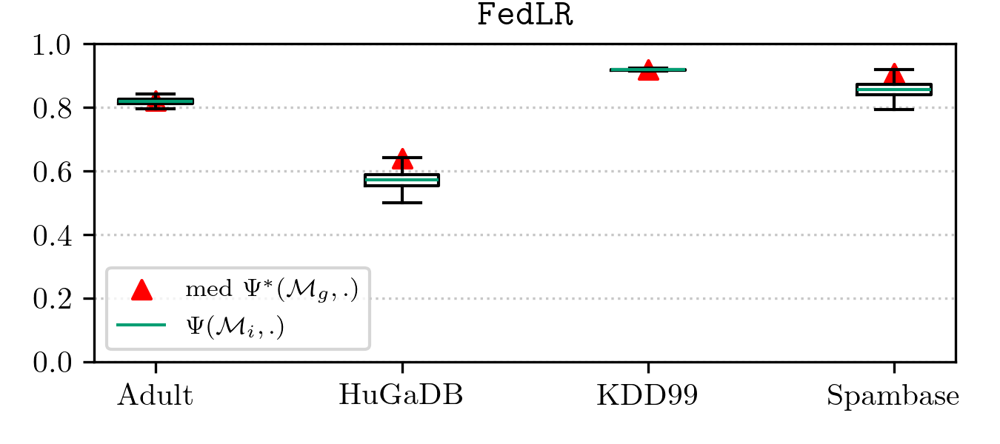
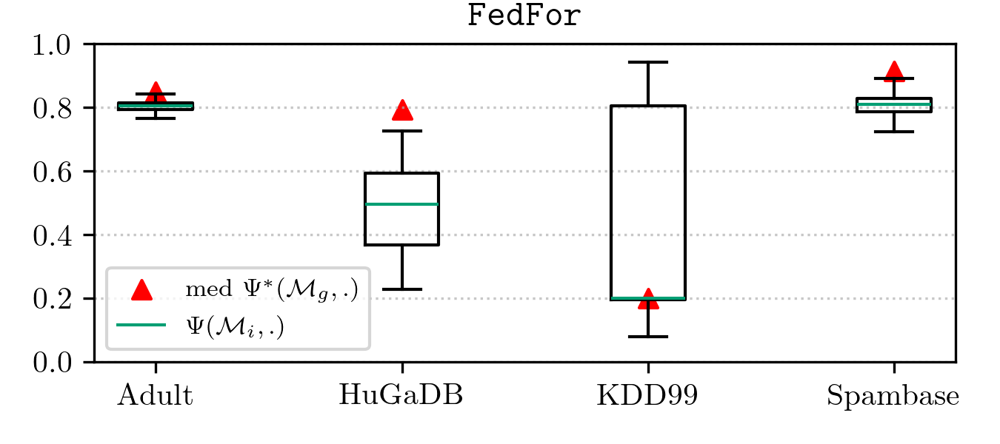

# WCNC 2026

## Costs and Incentives for Data Owners to Participate in Federated Learning Seen Through Game Theory

**Authors**  
Abbas Zal, Alessandro Buratto, Thomas Marchioro, Leonardo Badia  

**Emails**  
`{abbas.zal@studenti., alessandro.buratto.1@phd., thomas.marchioro@, leonardo.badia@}unipd.it`

---

## Code Used in the Paper

Zal A., Marchioro T., Badia L. *Costs and Incentives for Data Owners to Participate in Federated Learning Seen Through Game Theory*.  
In **2026 IEEE Wireless Communications and Networking Conference (WCNC)**. IEEE, 2026.

---

## Reproducing Results

First, clone the repository. Then, using a Python virtual environment or a Conda environment:

1. Activate the environment.
2. Install the dependencies:

```bash
pip install -r requirements.txt
```
---

## The Estimator

First, run `estimator.py`. This script supports two evaluation modes:

* **lodo** — Leave-One-Dataset-Out.
  For example, in one round the entire KDD99 history is used as the test set, while the histories of the other datasets (i.e., Spambase, HuGaDB, Adult) are used as the training set.

* **split** — Train/test split within each dataset.

Run from the project root directory:

```bash
python src/estimator.py lodo
```

and

```bash
python src/estimator.py split
```

The results are saved as follows:

* For **lodo** mode:
  `results/lodo_estimator_results.csv`

* For **split** mode:
  `results/split_estimator_results.csv`


---

## Figure Generation

### Grand Coalition Frequency vs Communication Cost

Before running the script, note that it uses LaTeX rendering via Matplotlib. You must install the following system packages:

```bash
sudo apt-get update
sudo apt-get install -y texlive-latex-extra cm-super dvipng
```

These packages provide the required LaTeX binaries and fonts used during figure generation.

To generate figures showing how the grand coalition frequency (as a stable coalition and Nash equilibrium) varies with the communication cost for different federated learning models and client counts, using:

* **Ψ*** — Perfect estimator
* **Ψ̂_SD** — Same-domain (split-dataset) estimator
* **Ψ̂_CD** — Cross-domain (LODO) estimator

run the following command from the project root directory:

```bash
python src/plot1.py
```

To see:

<p align="center">
  
  
</p>

---

### Bar Plots for Fixed Communication Cost and Number of Clients

This script generates bar plots comparing the grand coalition frequency obtained from:

* **Ψ***,
* **Ψ̂_SD**,
* **Ψ̂_CD**,

for a fixed number of clients and a fixed communication cost.

Run the script from the project root directory:

```bash
python src/plot2.py --cc <communication cost> --nc <number of clients>
```

Where:

* `--cc` is the communication cost **C**.
  Valid values are:

  ```
  0.0, 0.0125, 0.025, 0.05, 0.1
  ```

* `--nc` is the number of clients **N**.
  Valid values are:

  ```
  10, 20, 30, 40, 50, 60, 70, 80, 90, 100
  ```

Example:

```bash
python src/plot2.py --cc 0.025 --nc 50
```

To see:

<p align="center">
  
  
</p>

---

### Boxplots of Local Accuracy Distribution

To generate boxplots of the local accuracy distribution across clients, compared to the median global accuracy for each federated learning model, run `src/explore.py`.

Run from the project root directory:

```bash
python src/explore.py
```

To see:

<p align="center">
  
  
</p>

---

## BibTeX Citation

To cite this work, please use the following BibTeX entry:

```bibtex
@INPROCEEDINGS{11555251,
  author={Zal, Abbas and Buratto, Alessandro and Marchioro, Thomas and Badia, Leonardo},
  booktitle={2026 IEEE Wireless Communications and Networking Conference (WCNC)}, 
  title={Costs and Incentives for Data Owners to Participate in Federated Learning Seen Through Game Theory}, 
  year={2026},
  volume={},
  number={},
  pages={1-6},
  keywords={Modeling;Costing;Costs;Federated learning;Games;Printing;Accuracy;Equations;Training;Radio access networks;Federated learning;Game theory;Coalition formation;Distributed network management;Nash equilibrium},
  doi={10.1109/WCNC65185.2026.11555251}}

```
